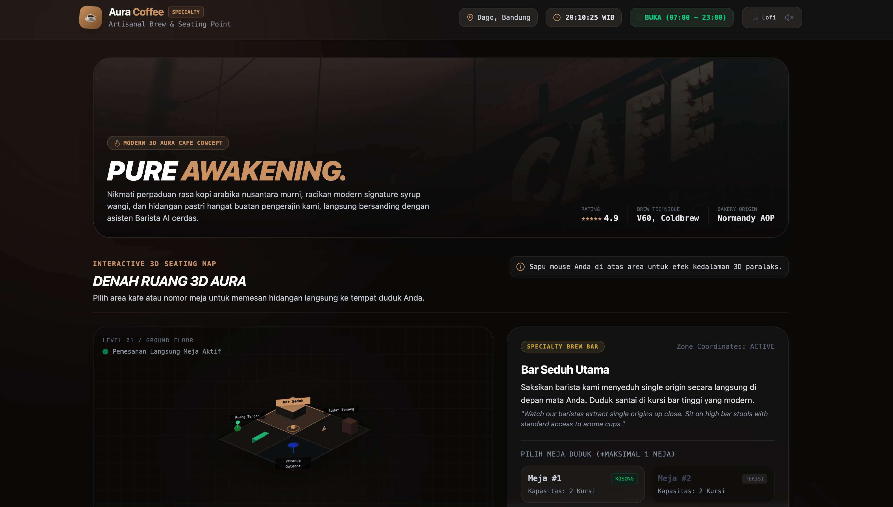

<h1 align="center">Coffe App Aura ☕</h1>

<p align="center">
  Web app fullstack untuk pengalaman <strong>cafe digital interaktif</strong>:
  katalog menu, visual area duduk, checkout, dan <strong>AI Barista</strong> berbasis Gemini.
</p>

<p align="center">
  
</p>


## Fitur Utama

- **AI Barista** (endpoint `/api/ai-barista`) untuk rekomendasi menu dalam Bahasa Indonesia.
- **Visual section cafe** (3D-styled UI) untuk memilih area/meja.
- **Menu interaktif** dengan kustomisasi minuman (hot/ice, sweetness, ice level, extra shot).
- **Cart & checkout** (endpoint `/api/checkout`) dengan simulasi struk transaksi.
- **UI modern glassmorphism** + ambient audio, jam WIB, dan status buka/tutup.

## Tech Stack

- Frontend: React + TypeScript + Vite
- Backend: Express + TypeScript (server tunggal di `server.ts`)
- AI: `@google/genai` (Gemini API)
- Styling/UI: Tailwind CSS + Motion + Lucide React

## Struktur Singkat Project

```text
.
├── server.ts              # Express server + API routes
├── src/
│   ├── App.tsx            # Layout utama aplikasi
│   ├── data.ts            # Data produk, section, dan meja
│   └── components/        # UI modular (AIBarista, MenuGrid, dll)
├── .env.example           # Contoh environment variables
└── package.json           # Scripts dan dependencies
```

## Menjalankan Project Secara Lokal

### 1) Prasyarat

- Node.js (disarankan versi LTS terbaru)

### 2) Install dependency

```bash
npm install
```

### 3) Konfigurasi environment

Salin file env lalu isi API key Gemini:

```bash
cp .env.example .env
```

Set nilai:

```env
GEMINI_API_KEY=your_api_key_here
```

### 4) Jalankan mode development

```bash
npm run dev
```

App berjalan di `http://localhost:3000`.

## Scripts

- `npm run dev` — jalankan server development (Express + Vite middleware)
- `npm run build` — build frontend dan bundle server ke `dist/`
- `npm run start` — jalankan hasil build production
- `npm run preview` — preview frontend build Vite
- `npm run lint` — type-check TypeScript (`tsc --noEmit`)
- `npm run clean` — hapus folder build

## Catatan

- Endpoint backend tersedia pada path `/api/*` di server yang sama.
- Jika `GEMINI_API_KEY` tidak diisi, fitur AI Barista tidak bisa digunakan.
